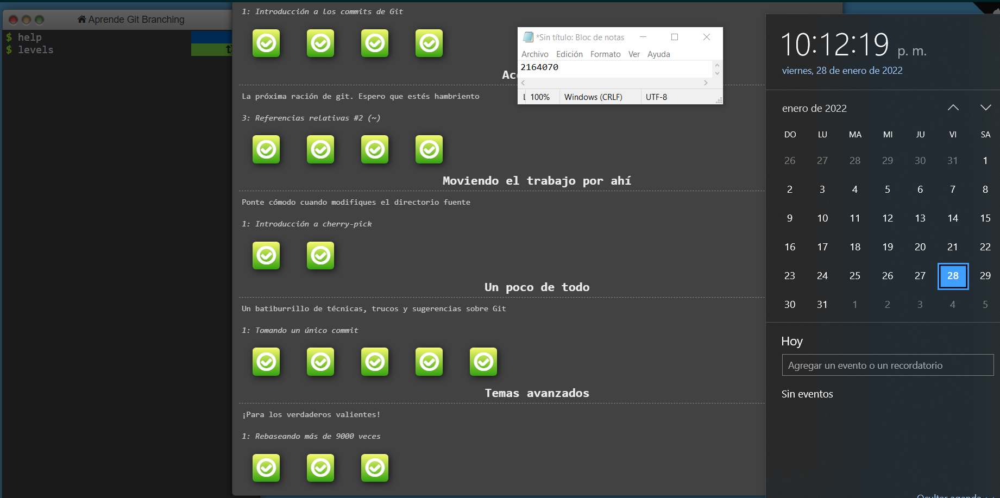
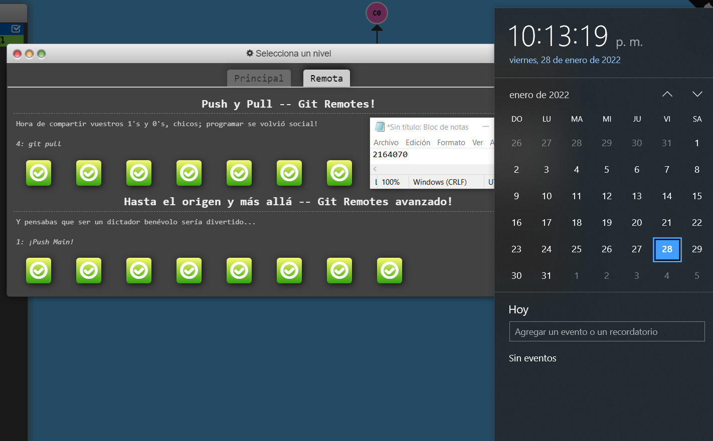

# **PARTE II-**

## Andres Felipe Parra Quiroga 
_Estudiante Ingeniería de Sistemas_


## **Presentación :**

Hola, soy Andres Parra estudiante de Ingenieria de sistemas de septimo semestre en la Escuela de Ingenieros Julio Garavito, actualmente trabajo como desarrollador full stack para Xorex de Colombia, administrando y desarrollando sobre la pagina de telefonica, principalmente usando _PHP_, _HTML_ y _JavaScript_ sinembargo mi lenguaje de programacion favorito es _Java_. 

### Hola mundo PHP:
```
    <?php 
        $H = "H"
        $O = "O"
        $L = "L"
        $A = "A"
        echo $H.$O.$L.$A." MUNDO";
    ?>
    
```
### Factorial de un número en Python:
```
    def factorial(n):
        return n * factorial(n - 1) if n > 1 else 1
    def main():
        num = factorial(int(input()))
        print(num)
    main()
```
## Gustos personales:

### Video Juegos Favoritos:
Me gustan los juegos de ROL y algunos MMORPG, aunque ultimamente intento jugar partidas rapidas, mis juegos favoritos:
*   World of Warcraft
*   Valorant
*   Hades


### El ultimo juego que me pase fue:


<div style="text-align: right"> It takes Two </div>

### Algunos de mis canciones favoritas:

1. The white Stripers - [Seven Nation Army](https://open.spotify.com/track/3dPQuX8Gs42Y7b454ybpMR?si=0ccea8cfe3654cf5)     
2. The Cat - [Meow](https://open.spotify.com/track/7cOmsSyGKpGLdsDdsgALCY?si=6153c516fd814ac2&nd=1)
3. Red Hot Chili Peppers -  [Can't Stop](https://open.spotify.com/track/3ZOEytgrvLwQaqXreDs2Jx?si=bd3d6a83ce70464b)


# PARTE III- GIT BRANCHING.
## LOCAL :

## REMOTO:

